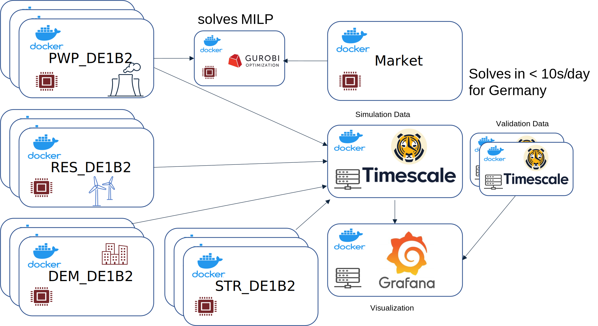

# distributed Multi Agent Simulation

This repository contains a distributed multi agent simulation.

# Requirements

- [docker](./docs/docker.md)
- alternatively local python
- server with data from [Open-Energy-Data-Server](https://github.com/NOWUM/open-energy-data-server/)

# Configuration

First, we need to configure the first lines of `generate_simulation_stack.py` to use the right structure database.

The best way to run the simulation is to configure `compose-start.sh` and run it.
This creates a `compose.yml` which is then started.

A Grafana is started as well and is available on http://localhost:3001/d/VdwbNAX72/dmas

# Agent Classes

DEM - Demand Agent 
    
* creates demand for its area

RES - Renewable Agents for Wind and Solar 
    
* bids renewables forecast

PWP - Powerplant Agent
    
* creates bidding with linked orders

MRK - Market Agent 
    
* clears market with linked and exclusive orders

STR - Storage Agent
    
* creates bidding with exclusive orders

# Scale-Out overview

# Literature from Libraries

### wind-python/windpowerlib 

*Sabine Haas; Uwe Krien; Birgit Schachler; Stickler Bot; kyri-petrou; Velibor Zeli; 
Kumar Shivam; Stephen Bosch*

### pvlib python: a python package for modeling solar energy systems.

*William F. Holmgren, Clifford W. Hansen, and Mark A. Mikofski* 
