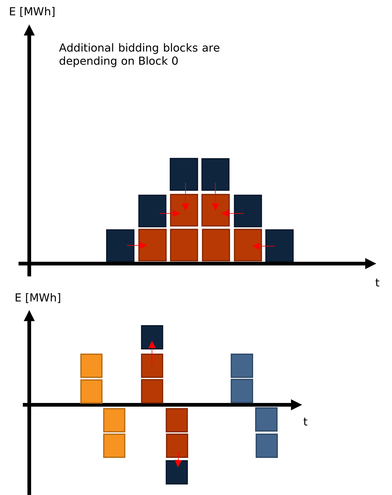

# Data Sources

To create the simulation one needs to use the crawlers which are available here:

https://github.com/NOWUM/open-energy-data-server/

The needed sources are:

* Marktstammdatenregister (MaStR)
* ECMWF (Weather Data from 2018 onwards)
* ERA5 (Weather Data from 1990-2018)
* OEP (Demand from open_eGo public database)
* ENTSOE (Generation data as validation or demand)

# Complex bidding

The Powerplant (PWP) agents are doing its [complex bidding using linked bids](../model/systems/powerPlant.py), while the Storage agents (STR) are [using exclusive orders](../model/systems/storage_hydroPlant.py).

Those are then cleared by the complex market clearing in the [market.py](../model/systems/market.py)

